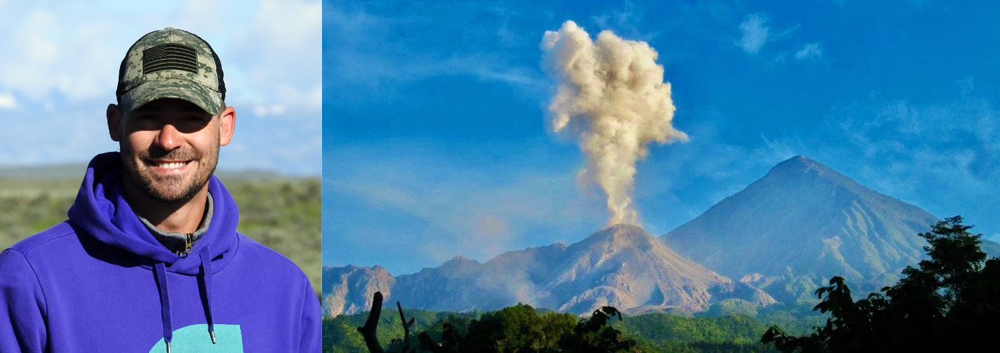

Hello, my name is **Alex Sehlke**, I am a research scientist at NASA Ames Research Center in California.

[^fn1]: contracting through the Bay Area Environmental Research Institute

I integrate field observations, laboratory experiments and modeling to study magma ascent, volcanic eruptions and lava emplacement on Earth and other rocky bodies in the solar system. My work includes the study of the physical and thermal properties of terrestrial lava, planetary analog magma/lava. Moreover, I use Thermoluminescence to reconstruct the thermal and temperature history of geologic samples. Moreover, I study the use of portable spectrometers (VNIR, XRF, LIBS) on volcanic terrains, and how they may be incorporated into future human space flight missions. I am also developing science instruments for future lunar payload missions.

I am very intersted to work with students in the field and/or helping with laboratory experiments. Please [email me](mailto:alexander.sehlke@nasa.gov) for opportunities.

**Research keywords:** Magma/Lava Rheology; Lava Flow Morphology; Heat Transfer (thermal diffusivity and conductivity, heat capacity); Thermoluminescence; Remote Sensing