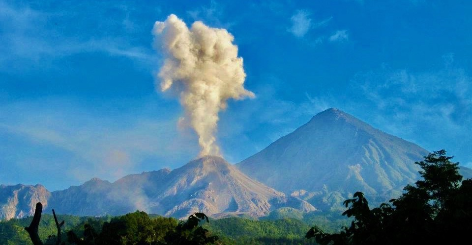

**Dr. Alexander Sehlke** ([curriculum vitae](static/sehlke-cv-feb-2020.pdf)) is a researcher in the [Space Sciences & Astrobiology Division, Planetary Systems Branch](https://spacescience.arc.nasa.gov/branch/planetary-systems-branch-code-sst/) of NASA Ames Research Center (ARC) and a member of the [Bay Area Environmental Research Institute](https://baeri.org).
