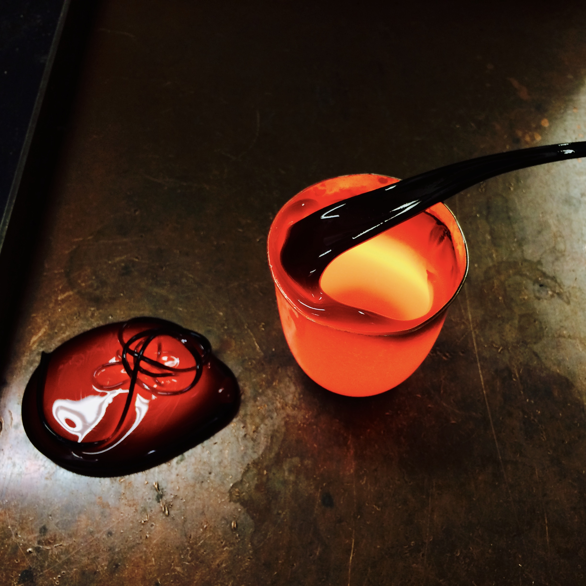

I am have several active research grants supporting the following studies:

* **Magma/Lava Rheology and Flow Laws:** I operate a rheometer to measure the viscosity of silicate melts (liquids and crystal suspensions) between 1 to 106 Pa s, and up to 1700 ºC. The theometer is attached to a CO/CO2 gas mixing unit to conduct experiments at desired oxygen fugacities, which makes it possible to investigate the rheological evolution during cooling and crystallization for iron-bearing magmas/lavas, such as lunar and martian basalts. It is possible to in-situ sample the magma/lava by a rapid quenching technique for further investigation (e.g., crystallinity, crystal assemblages and textures, mixing textures).

  

  

* **Thermoluminescence Studies of Lunar Samples and Meteorites:**

* 

* **Spectral and Geochmical Signatures of Spatter Deposits interacting with Water and Ice:**